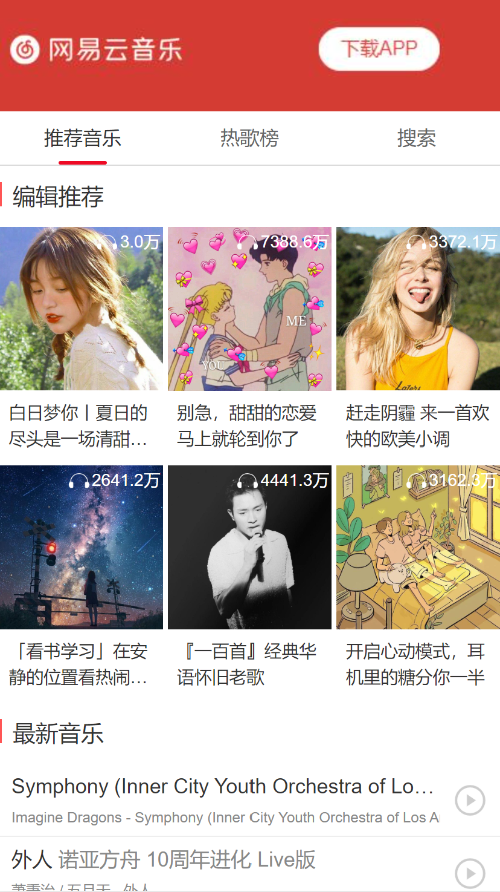
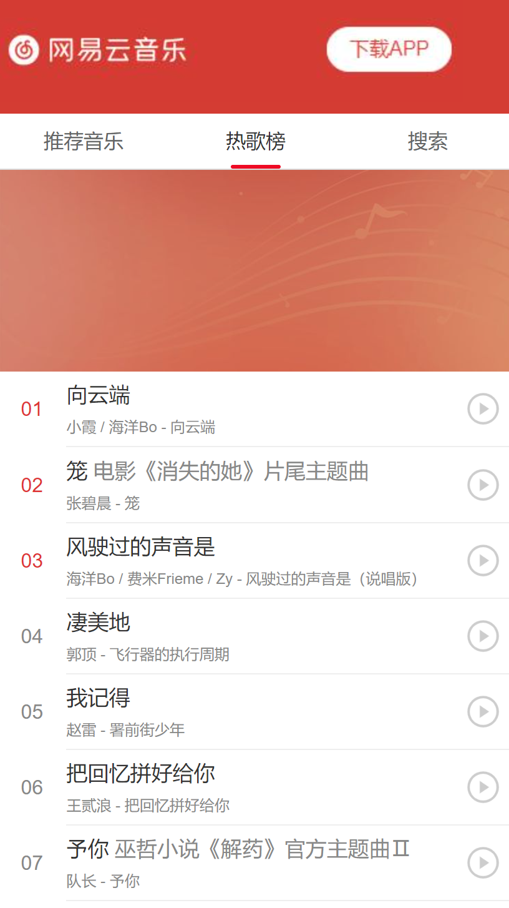
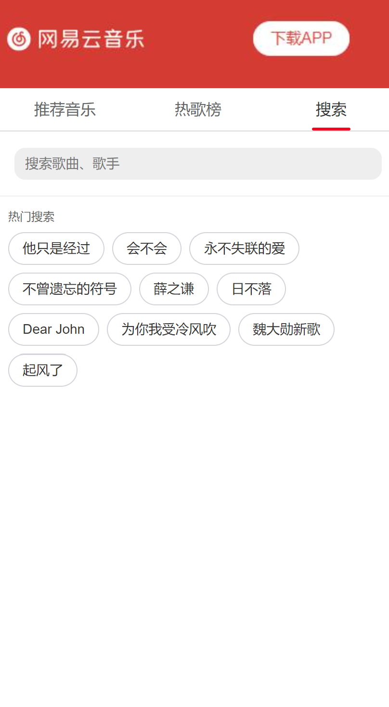
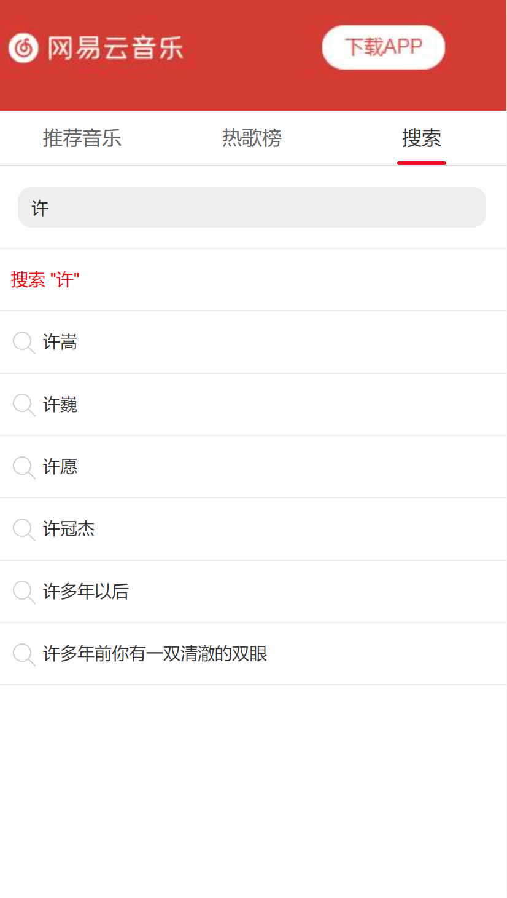
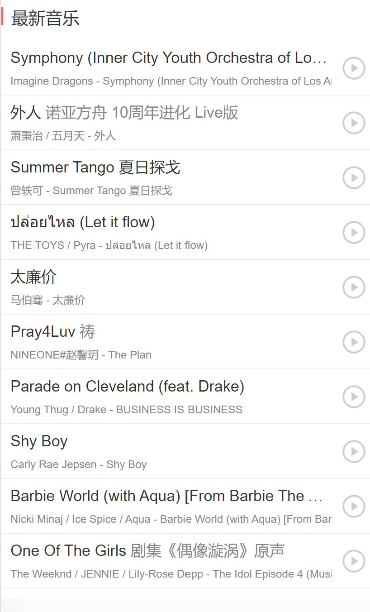

# 基于Vue2的音乐播放器（仿网易云移动版）


### 项目说明
   本项目基于网易云API搭建仿网易云音乐播放器，实现网易云移动端页面复原。

### 技术栈
   Vue2+Vue-cli+Vue-Router+Axios+ES6+Vant

### 项目实现页面
1、推荐音乐
2、热歌榜
3、搜索歌曲
4、歌单列表
5、音乐播放

### 项目亮点

1、Axios二次封装
   准备request.js对网络请求二次封装
   ```
//添加请求拦截器
instance.interceptors.request.use(function (config) {//config发送请求的配置参数信息
    //config可以判断请求的方式get/post 请求url参数地址 headers请求头配置 参数data发送的数据等信息
    // console.log('config-请求拦截器',config);
    //对post请求处理参数
    if(config.method =='post'){
        config.data = qs.stringify(config.data)
    }
    // 在发送请求之前做些什么--对post请求参数 处理字符串拼接
    return config;
  }, function (error) {
    // 对请求错误做些什么
    return Promise.reject(error);
});


// 添加响应拦截器 -- 对错误的数据处理参数
//网络请求常见错误信息 
// 404 地址接口错误  500 505 服务器错误 200 成功  300 重定向 
instance.interceptors.response.use(function (response) {
    // 对响应数据做点什么
    return response;
  }, function (error) {
    console.log('error',error);
    // 对响应错误做点什么
    const { response } = error;
    //response.status 错误状态   500 服务器错误  response.info 信息提示
    errorHandle(response.status,response.info)
    // return Promise.reject(error);
});
```


2、配置代理服务器
   在vue.config.js中进行配置
   ```
   proxy: {
      '/api': {
        target: 'http://iwenwiki.com:3000',//目标地址 请求的后台接口 
        ws: true,
        changeOrigin: true,
        pathRewrite:{//路径重写
          "^/api":''
        }
      },
      //https://interface.music.163.com
      '/foo': {
        target: 'https://interface.music.163.com',//目标地址 请求的后台接口 
        ws: true,
        changeOrigin: true,
        pathRewrite:{//路径重写
          "^/foo":''
        }
      },
      '/boo': {
        target: 'https://music.163.com',//目标地址 请求的后台接口 
        ws: true,
        changeOrigin: true,
        pathRewrite:{//路径重写
          "^/boo":''
        }
      }
   }
   ```


3、提取公共组件MusicList
   HotMusic与PlayList页面都存在相同音乐列表且请求数据返回值名称相同，因此提取公共组件MusicList
   ```
   <div class="list-item" @click="playMusic(item.id,item.name)">
        <div class="left">
            <div class="subtitle">{{ item.name }} <span>{{ item.alia[0] }}</span> </div>
            <div class="author">
                <span v-for="ele in item.ar" :key="ele.id" class="ele">
                    {{ ele.name }}
                </span>
                - {{ item.al.name }}
            </div>
        </div>
        <div class="right">
            
        </div>
    </div>
   ```


4、Vant组件库
   Tabber栏切换页面可以使用路由实现也可以使用选项卡实现，此处使用Vant组件库中选项卡进行切换
```
<van-tabs v-model="active">
    <van-tab title="推荐音乐" name="1"><Music></Music></van-tab>
    <van-tab title="热歌榜" name="2"><HotMusic></HotMusic></van-tab>
    <van-tab title="搜索" name="3"><Search></Search></van-tab>
</van-tabs>
```


5、配置路由及路由传参
   组件间部分数据传递通过路由传参实现
   ```
    <router-link :to="{name:'songpage',params:{id:item.id,name:item.name}}" class="list-item">
        ···
    <router-link/>
   ```
   ```
   {
    //动态路由
    path:'/playlist/:id',
    name:'playlist',
    component:PlayList,
    props:true
  },
  {
    path:'/songpage/:id/:title',
    name:'songpage',
    component:SongPage,
    props:true
  }
   ```


### 项目效果





### 接口
1. 推荐音乐
    http://iwenwiki.com:3000/toplist/detail

2. 最新音乐
    https://interface.music.163.com/weapi/personalized/newsong
    请求方式：
        post 
    参数：
        params
        encSecKey
    
3. 推荐音乐 分类歌曲列表界面
   xx/xx/id=2230318386 
    
4. 音乐精彩评论 歌曲评论的代码
    https://music.163.com/api/v1/resource/comments/R_SO_4_2015976648(id号)

5. 音乐播放地址 （id参数）
    https://music.163.com/outchain/player?type=2&id=2015976648&auto=1&height=66&bg=e8e8e8

6. 歌词接口
    http://iwenwiki.com/lyric?id=33894312

7. 热门搜索
    http://iwenwiki.com:3000/search/hot

8. 搜索接口 
    http://iwenwiki.com:3000/search/suggest?keywords=后来&type=mobile

